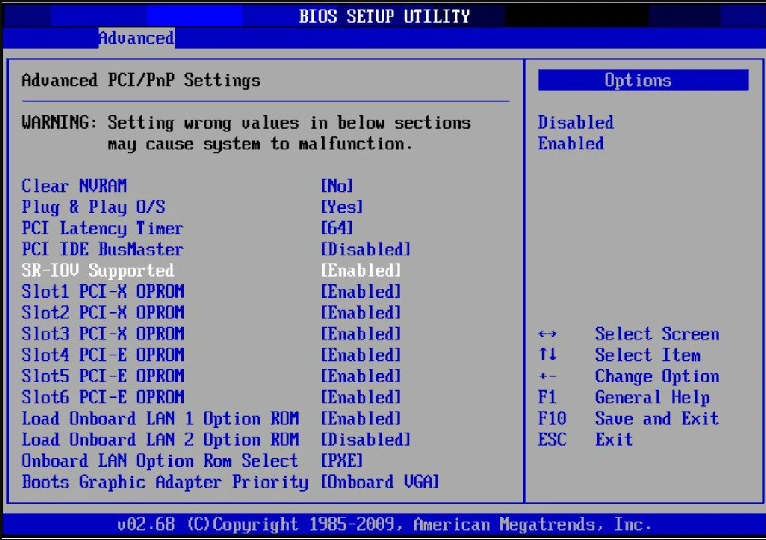
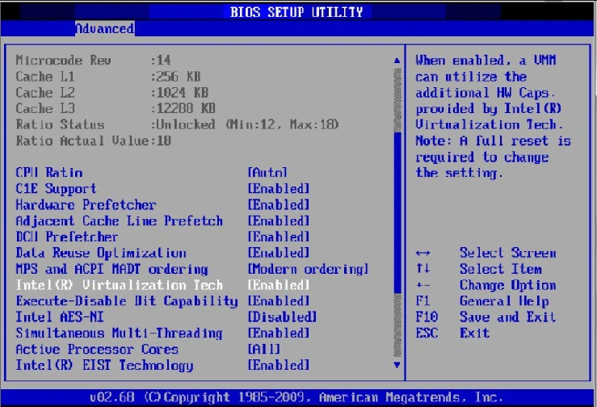

# Creating Virtual Machines with SRIOV networks end to end

This is an end to end demo with a few options on how to put together SRIOV and OpenShift Virtualization together. It's a work in progress. More to come...

## Contents

1. [Requirements](#requirements)

2. [OpenShift Bare Metal Installation](#bare-metal)

3. [Supported SRIOV network cards and configuration](#sriov-cards)

4. [Enabling SRIOV and CPU virtualization in the server BIOS](#enabling-sriov-bios)

5. [Configuring OpenShift Worker nodes for OCP-V and SRIOV](#ocp-worker-sriov-config)

6. [Installing SRIOV operator](#sriov-operator-install)

7. [Creating SRIOV network node policies](#sriov-network-node-policies)

8. [Creating SRIOV networks](#sriov-network-node-policies)

9. [Installing OpenShift Virtualization Operator](#ocp-virtualization-operator-install)

10. [Creating container disk images for VMs](#container-disks)

11. [Creating Virtual Machines with Additional Networks](#vm-additional-networks)

12. [Exposing Virtual Machine Services](#exposing-vm-services)

### 1. Requirements <a name="requirements"></a>

The first and most important element is a server with a few characteristics: cpu virtualization technology, enough memory, cpu and storage to receive a single node OpenShift cluster (for OCP 4.14: 16Gb of ram, 8 vCPUs and 120 GB of storage). It should have at least one free PCI slot for an SRIOV card. For reference about a single node OpenShift you may check [here](https://access.redhat.com/documentation/en-us/openshift_container_platform/4.14/html/installing/installing-on-a-single-node#preparing-to-install-sno). Those are the minimum hardware requirements for the platform itself. We also need resources for virtual machines that will be running on top of OCP virtualization. Those will vary depending on how many VMs will be running and how much resources they will consume. For a simple demo even a 32Gb of ram with 16vCPUs should work. [Check the bare metal installation below on item 2.](#bare-metal) We opted for the easiest install method: the assisted installer.

A second and also essential requirement is the SRIOV capable network card. For the purpose of this specific demo we used two different SRIOV capable network interface cards or as also sometimes called HCAs (Host Channel Adapters). [Check on supported cards below on section 3.](#sriov-cards)

### 2. OpenShift Bare Metal Installation <a name="bare-metal"></a>

For our demo we used in single node OpenShift option (SNO) and we installed using the OpenShift assisted installer. [Here](https://access.redhat.com/documentation/en-us/assisted_installer_for_openshift_container_platform/2024/html/installing_openshift_container_platform_with_the_assisted_installer/index) you can check it's full documentation for all options it offers and all of the requirements that must be in place before starting a new OpenShift installation. With a free customer account you can use a trial version of OpenShift for up to 60 days which enough time to develop a proof of concept or a demo project.

### 3. Supported SRIOV network cards and configuration <a name="sriov-cards"></a>

[Here](https://access.redhat.com/documentation/en-us/openshift_container_platform/4.14/html/networking/hardware-networks#supported-devices_about-sriov) you can find the list of the sriov devices supported for OpenShift as well as the vendor and device IDs for them sparing us from checking on the host system.


### 4. Enabling SRIOV and CPU virtualization in the server BIOS <a name="enabling-sriov-bios"></a>

The BIOS software depends on the server you have. Here is an intel type:





### 5. Configuring OpenShift Worker nodes for OCP-V and SRIOV <a name="ocp-worker-sriov-config"></a>

One of the steps that is commonly done is to also label the nodes for the sriov network node policies to take effect on.

Here is how you can label your node:

`oc label node < your node name > feature.node.kubernetes.io/network-sriov.capable=true`

If you want to check if the label is actually in your node run:

`oc describe node < your node name > | grep feature.node.kubernetes.io/network-sriov.capable=true`

To understand more on how to manage OpenShift nodes please check [here](https://docs.openshift.com/container-platform/4.14/nodes/nodes/nodes-nodes-viewing.html)

### 6. Installing SRIOV operator <a name="sriov-operator-install"></a>

Please refer to [Installing the sriov network operator](https://docs.openshift.com/container-platform/4.14/networking/hardware_networks/installing-sriov-operator.html) docs.
### 7. Creating SRIOV network node policies <a name="sriov-network-node-policies"></a>

The sriov network node policy automates the configuration of the sriov devices available on the each worker node. It's important to label your nodes accordingly. In the example below the field nodeSelector will allow the manifest to be only applied on the nodes that contain the label `feature.node.kubernetes.io/network-sriov.capable: 'true'`. Other labels may be added for specific purposes and different device configurations.

To create an sriov network node policy custom resource in OpenShift we need to find the vendor and device IDs for the sriov network interface card and those will be used by the nicSelector in order to find the right device. You have that information from the supported devices page but here is how you can discover them in the system itself if needed:


  a. Find the name of your node:

`oc get nodes`

```
NAME         STATUS   ROLES                         AGE   VERSION
pa-vnf-sno   Ready    control-plane,master,worker   6d    v1.27.9+e36e183

```
  b. run a debug pod with:

`oc debug node/my-node-name`

```
Temporary namespace openshift-debug-9n6xp is created for debugging node...
Starting pod/pa-vnf-sno-debug-6k6f9 ...
To use host binaries, run `chroot /host`
Pod IP: 192.168.23.10
If you don't see a command prompt, try pressing enter.
sh-4.4# 

```

c. once logged in change the root fs to the one on the host directory and run bash for a better shell. With that you have a terminal in the host OS of your SNO cluster.

`chroot /host /bin/bash`

```
sh-4.4# chroot /host /bin/bash
[root@pa-vnf-sno /]# 

```

d. Now we can verify the SRIOV devices, device ID and vendor ID. In the snippet below we show an intel card where the vendor ID is 8086 and the device ID is 158b.

`lspci -nnv | grep -i ethernet`

```
18:00.0 Ethernet controller [0200]: Intel Corporation Ethernet Controller XXV710 for 25GbE SFP28 [8086:158b] (rev 02)    
        Subsystem: Intel Corporation Ethernet Network Adapter XXV710-2 [8086:0001]                                       
18:00.1 Ethernet controller [0200]: Intel Corporation Ethernet Controller XXV710 for 25GbE SFP28 [8086:158b] (rev 02)    
        Subsystem: Intel Corporation Ethernet Network Adapter XXV710 [8086:0000]

[... output truncated because of size...]         
```

  e. Make sure the cards have sriov and ARI enabled by using the device ID as below. Here is an exemple with an intel card:

`lspci -nnv -d :158b
```
18:00.0 Ethernet controller [0200]: Intel Corporation Ethernet Controller XXV710 for 25GbE SFP28 [8086:158b] (rev 02)
        Subsystem: Intel Corporation Ethernet Network Adapter XXV710-2 [8086:0001]
        Flags: bus master, fast devsel, latency 0, IRQ 18, NUMA node 0, IOMMU group 19
        Memory at a7000000 (64-bit, prefetchable) [size=16M]
        Memory at a8808000 (64-bit, prefetchable) [size=32K]
        Expansion ROM at a9000000 [disabled] [size=512K]
        Capabilities: [40] Power Management version 3
        Capabilities: [50] MSI: Enable- Count=1/1 Maskable+ 64bit+
        Capabilities: [70] MSI-X: Enable+ Count=129 Masked-
        Capabilities: [a0] Express Endpoint, MSI 00
        Capabilities: [100] Advanced Error Reporting
        Capabilities: [140] Device Serial Number 54-a4-26-ff-ff-b7-a6-40
        Capabilities: [150] Alternative Routing-ID Interpretation (ARI)  <--- ARI
        Capabilities: [160] Single Root I/O Virtualization (SR-IOV) <--- sriov
        Capabilities: [1a0] Transaction Processing Hints
        Capabilities: [1b0] Access Control Services
        Capabilities: [1d0] Secondary PCI Express
        Kernel driver in use: i40e
        Kernel modules: i40e

18:00.1 Ethernet controller [0200]: Intel Corporation Ethernet Controller XXV710 for 25GbE SFP28 [8086:158b] (rev 02)
        Subsystem: Intel Corporation Ethernet Network Adapter XXV710 [8086:0000]
        Flags: bus master, fast devsel, latency 0, IRQ 18, NUMA node 0, IOMMU group 20
        Memory at a6000000 (64-bit, prefetchable) [size=16M]
        Memory at a8800000 (64-bit, prefetchable) [size=32K]
        Expansion ROM at a9080000 [disabled] [size=512K]
        Capabilities: [40] Power Management version 3
        Capabilities: [50] MSI: Enable- Count=1/1 Maskable+ 64bit+
        Capabilities: [70] MSI-X: Enable+ Count=129 Masked-
        Capabilities: [a0] Express Endpoint, MSI 00
        Capabilities: [100] Advanced Error Reporting
        Capabilities: [140] Device Serial Number 54-a4-26-ff-ff-b7-a6-40
        Capabilities: [150] Alternative Routing-ID Interpretation (ARI)
        Capabilities: [160] Single Root I/O Virtualization (SR-IOV)
        Capabilities: [1a0] Transaction Processing Hints
        Capabilities: [1b0] Access Control Services
        Kernel driver in use: i40e
        Kernel modules: i40e
```
  f. Create the SRIOV network node policy using the vendor and device IDs.
  
  A few comments on the example below:
  
  - pfNames is a wild card like name. enp3f0 is the actual interface in the system. Virtual functions will be created ranging from 0-31 in this example. We use a # symbol to separate the range. This avoid writing a tedious list with names increasing by 1 at each new VF. 
  - nodeSelector will match the label on the node
  - numVfs will configure the card to enable that many VFs. Check how many VFs your card can handle.
  - the resource name is arbitrary. That is the name that will be used by the next step to create the network attachments for your VMs.

Here goes an example with a Mellanox card:
```
apiVersion: sriovnetwork.openshift.io/v1
kind: SriovNetworkNodePolicy
metadata:
  name: policy-sriov-mcx4-enp11s0f0np0
  namespace: openshift-sriov-network-operator
spec:
  deviceType: vfio-pci
  isRdma: false
  nicSelector:
    deviceID: '1015'
    pfNames:
      - 'enp3f0#0-31'
    vendor: '15b3' 
  nodeSelector:
    feature.node.kubernetes.io/network-sriov.capable: 'true'
  numVfs: 64
  priority: 97
  resourceName: sriov-device
```
OBS: your server may boot here... Kernel modules and firmware options need to be applied.

Check if your policy was created.
`oc get sriovnetworknodepolicy -n openshift-sriov-network-operator` 
```
NAME                             AGE
default                          62m
policy-sriov-mcx4-enp11s0f0np0   25m
```

For more in depth details please refer to [configure an sriov device in OpenShift](https://docs.openshift.com/container-platform/4.14/networking/hardware_networks/configuring-sriov-device.html) docs.


### 8. Creating SRIOV networks <a name="sriov-network-node-policies"></a>

The SRIOV network custom resource automates the creation of a network attachment definition for the guest VM namespace (or project in OpenShift). The network attachment definition (NAD for short) describes the behavior of additional networks to be added to the VMs. The NAD relies on [multus-cni](https://github.com/k8snetworkplumbingwg/multus-cni) to create additional networks. For more information on sriov network check [here](https://docs.openshift.com/container-platform/4.14/networking/hardware_networks/configuring-sriov-net-attach.html)

The example below creates an additional network within vlan 10 for the VMs to attach to. This additional network will be available in the `sriov-guests` namespace and based on the `sriov-device` configured previously in the sriov-network-node-policy. The ip address management is of type DHCP and presupposes that vlan 10 has a DHCP server attached to it in order for the VMs to configure their ip addresses using DHCP.

```
apiVersion: sriovnetwork.openshift.io/v1
kind: SriovNetwork
metadata:
  name: mcx4-enp11s0f0np0-vlan10-dhcp
  namespace: openshift-sriov-network-operator
spec:
  ipam: |-
    {
      "ipam": {
        "type": "dhcp"
      }
    }
  networkNamespace: sriov-guests
  resourceName: sriov-device
  vlan: 10
```
Verifying the node state:

`oc get sriovnetworknodestate -n openshift-sriov-network-operator`
```
NAME         AGE
ocp-pa-poc   25m
```
`oc describe sriovnetworknodestate -n openshift-sriov-network-operator`
```
Name:         ocp-pa-poc
Namespace:    openshift-sriov-network-operator
Labels:       <none>
Annotations:  <none>
API Version:  sriovnetwork.openshift.io/v1
Kind:         SriovNetworkNodeState
Metadata:
  Creation Timestamp:  2024-01-19T15:50:36Z
  Generation:          1
  Managed Fields:
    API Version:  sriovnetwork.openshift.io/v1
    Fields Type:  FieldsV1
    fieldsV1:
      f:metadata:
        f:ownerReferences:
          .:
          k:{"uid":"3877cf25-6821-413e-aa09-da457b4bf601"}:
      f:spec:
        .:
        f:dpConfigVersion:
    Manager:      sriov-network-operator
    Operation:    Update
    Time:         2024-01-19T15:50:36Z
    API Version:  sriovnetwork.openshift.io/v1
    Fields Type:  FieldsV1
    fieldsV1:
      f:status:
        .:
        f:interfaces:
        f:syncStatus:
    Manager:      sriov-network-config-daemon
    Operation:    Update
    Subresource:  status
    Time:         2024-01-19T15:51:08Z
  Owner References:
    API Version:           sriovnetwork.openshift.io/v1
    Block Owner Deletion:  true
    Controller:            true
    Kind:                  SriovNetworkNodePolicy
    Name:                  default
    UID:                   3877cf25-6821-413e-aa09-da457b4bf601
  Resource Version:        2389428
  UID:                     ff85bd15-9113-4919-a382-0482ab453d26
Spec:
  Dp Config Version:  33a88d0f5d0b0cb4d2c43fb7846b87df
Status:
  Interfaces:
    Device ID:      1015
    Driver:         mlx5_core
    E Switch Mode:  legacy
    Link Speed:     10000 Mb/s
    Link Type:      ETH
    Mac:            e8:eb:d3:13:06:16
    Mtu:            1500vm-additional-networks
    Totalvfs:       8
    Vendor:         15b3
    Device ID:      1015
    Driver:         mlx5_core
    E Switch Mode:  legacy
    Link Speed:     -1 Mb/s
    Link Type:      ETH
    Mac:            e8:eb:d3:13:06:17
    Mtu:            1500
    Name:           enp11s0f1np1
    Pci Address:    0000:0b:00.1
    Totalvfs:       8
    Vendor:         15b3
  Sync Status:      Succeeded
Events:             <none>

```
For more in depth details on how to configure sriov networks please refer to configuring an [SR-IOV ethernet network attachment](https://docs.openshift.com/container-platform/4.14/networking/hardware_networks/configuring-sriov-net-attach.html) in OpenShift docs.

### 9. Installing OpenShift Virtualization Operator <a name="ocp-virtualization-operator-install"></a>

You can find [here](https://docs.openshift.com/container-platform/4.14/virt/install/installing-virt.html) the instructions for the OpenShift virtualization operator.

### 10. Creating container disk images for VMs <a name="#container-disks"></a>

Virtual machines require an operating system image to run. One of the ways we can bring an OS image to OpenShift platform and use it for virtualization is by embedding this operating system image into a container. In order to accomplish this step we need to have [podman](https://podman.io/docs/installation) installed. Once we have it we need the image source file in one of the two formats: [qcow2 or raw](https://access.redhat.com/documentation/en-us/red_hat_virtualization/4.4/html/technical_reference/qcow2) format.

If you have your operating system image in ISO format you can covert it to qcow2 or raw by using the qemu image utility [qemu-img](https://www.qemu.org/docs/master/tools/qemu-img.html#cmdoption-qemu-img-arg-convert) and setting the [format](https://www.qemu.org/docs/master/system/images.html#disk-image-file-formats) for your use case. To install the tool you may have to use a package manager and search for qemu-img or qemu-utils package. For other operating systems check the official qemu [documentation](https://www.qemu.org/download/).

Here is a simple example with the flag -O for output format. You can always check the full range of options and flags by running "qemu-img convert --help".

```
qemu-img convert -O qcow2 my_image.iso my_image.qcow2
```

All right. With a proper image file, in qcow2 or raw format we can build the container image with the operating system to be used for our virtual machines. For that we need to create a container file (a.k.a. Dockerfile) that copies our image file to that container image. Below we can see an example using an ubi8 image from Red Hat. Remark that we are changing the owner ID of that file before copying it. That's due to qemu default's User ID (UID) being 107. We change also the permissions to 440 which means that the user and its group are allowed to read only that file and nothing else. Then it's copied to the `/disk` directory.

```
FROM registry.access.redhat.com/ubi8/ubi:latest AS builder
ADD --chown=107:107 <vm_image>.qcow2 /disk/ \
RUN chmod 0440 /disk/*

FROM scratch
COPY --from=builder /disk/* /disk/
```

Once we have those lines above copied to a container file we can build the image using podman by running the commands below:

```
podman build -t <registry>/<container_disk_name>:latest .
``` 

```
podman push <registry>/<container_disk_name>:latest
``` 
Example with Palo Alto Next Generation Firewall VM-Series (assuming we've already converted a file named ngfw.ISO to ngfw.qcow2).
Here we use the command cat to create a Dockerfile on the current directory.

```
cat > Dockerfile << EOF
FROM registry.access.redhat.com/ubi8/ubi:latest AS builder
ADD --chown=107:107 ngfw.qcow2 /disk/ \
RUN chmod 0440 /disk/*

FROM scratch
COPY --from=builder /disk/* /disk/
EOF
```
Yet in the current directory we may run:

```
podman build -t quay.io/acmenezes/ngfw:latest .
```
-t is for tag and the dot in the end means it's context directory where it should look for the Dockerfile.

You may check if the image is present in your local registry by running `podman image list`. 

Finally push it to your registry:
```
podman push quay.io/acmenezes/ngfw:latest
```

One note: if you are new to containers, the container disk name is arbitrary. You may choose it according to your needs. The [registry](https://www.redhat.com/en/topics/cloud-native-apps/what-is-a-container-registry) is where we store container images for pulling them when we need. If you don't have a registry to push your container image you can create one on [quay.io](https://quay.io/) by registering a with a Red Hat account which you can create following quay.io sign in instructions.

For more details please visit OpenShif docs on [Creating VMs by using container disks](https://docs.openshift.com/container-platform/4.14/virt/virtual_machines/creating_vms_custom/virt-creating-vms-from-container-disks.html#virt-preparing-container-disk-for-vms_virt-creating-vms-from-container-disks).


### 11. Creating Virtual Machines with Additional Networks <a name="vm-additional-networks"></a>

We have a few VM manifests in yaml format that can be used as a template to build other VMs by altering the images and its details under manifests/03-virtual-machines.

Here is how you apply them to the cluster:

`oc apply -f XXV710-vm-guest.yaml`

### 12. Exposing Virtual Machine Services <a name="exposing-vm-services"></a>

Finally to expose a service from the VM we use a label to select the VMs like we do with a pod. Here is where you can find the step by step to do it:

https://docs.openshift.com/container-platform/4.14/virt/vm_networking/virt-exposing-vm-with-service.html
