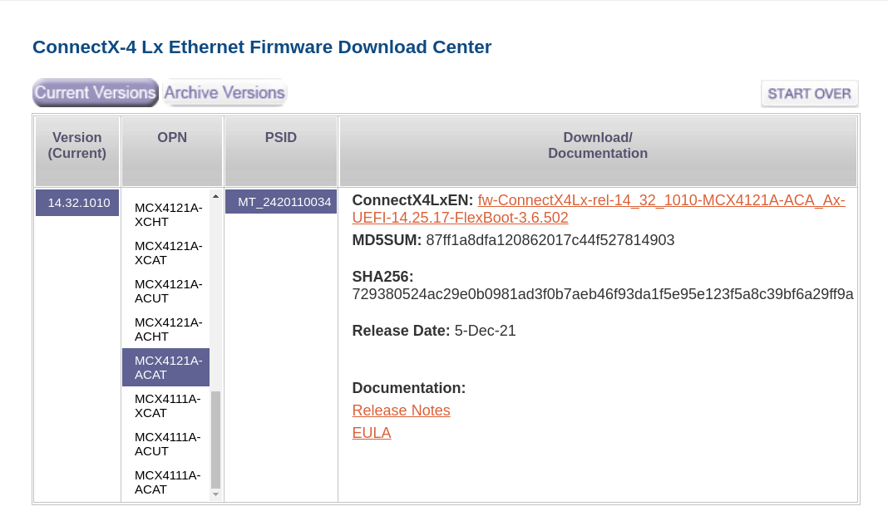

# OpenShift Virtualization with SRIOV

## Quick Troubleshooting Tips

<br>

### Checking on BIOS options:

<br>

Reference Links:

https://docs.nvidia.com/networking/display/mlnxofedv531001/single+root+io+virtualization+(sr-iov)#src-47033949_safe-id-U2luZ2xlUm9vdElPVmlydHVhbGl6YXRpb24oU1JJT1YpLXNldHRpbmd1cHNyLWlvdg

https://forums.developer.nvidia.com/t/enable-hca-timeout-when-enabling-more-than-7-vfs-on-connectx-5/206600

<br> …check if your BIOS has ARI (Alternate Routing ID) setting enabled. If it is not enabled, please enable it for Virtual Functions and check again.

<br>

### Configuring Mellanox mlx5 cards:

<br>

Reference Links:

https://enterprise-support.nvidia.com/s/article/HowTo-Configure-SR-IOV-for-ConnectX-4-ConnectX-5-ConnectX-6-with-KVM-Ethernet

https://access.redhat.com/articles/3082811

https://forums.servethehome.com/index.php?threads/how-to-use-the-mlx5_core-driver-with-mellanox-connectx-4-lx-in-debian.35663/

https://medium.com/@krisiasty/mellanox-nic-configuration-in-bare-metal-openshift-clusters-4a242d767e6b


### Checking on firmware compatibility:

<br>

`dmesg` showing mlx5_core and mlx5_init errors may represent firmware compatibility issues:
```
[ 2649.081798] mlx5_core 0000:0b:05.7: mlx5_function_setup:1103:(pid 97972): enable hca failed
[ 2649.123873] mlx5_core 0000:0b:05.7: probe_one:1686:(pid 97972): mlx5_init_one failed with error code -110
[ 2649.142626] mlx5_core: probe of 0000:0b:05.7 failed with error -110
[ 2649.142666] pci 0000:0b:06.0: [15b3:1016] type 00 class 0x020000
[ 2649.147694] pci 0000:0b:06.0: Adding to iommu group 161
[ 2649.148098] mlx5_core 0000:0b:06.0: firmware version: 14.32.1010
[ 2710.157384] mlx5_core 0000:0b:06.0: wait_func:1133:(pid 97972): ENABLE_HCA(0x104) timeout. Will cause a leak of a command resource
[ 2710.157400] mlx5_core 0000:0b:06.0: mlx5_function_setup:1103:(pid 97972): enable hca failed
[ 2710.199819] mlx5_core 0000:0b:06.0: probe_one:1686:(pid 97972): mlx5_init_one failed with error code -110
[ 2710.218669] mlx5_core: probe of 0000:0b:06.0 failed with error -110
[ 2710.218714] pci 0000:0b:06.1: [15b3:1016] type 00 class 0x020000
[ 2710.223875] pci 0000:0b:06.1: Adding to iommu group 162
[ 2710.224301] mlx5_core 0000:0b:06.1: firmware version: 14.32.1010
``` 

Reference Links:
https://forums.developer.nvidia.com/t/mlx5-core-enable-hca-failed-mlx5-load-one-failed-with-error-code-22/207143


### Firmware Upgrade Check

<br>

`# mstflint -d 0b:00.0 query`
```
Image type:            FS3                                                                                                                  
FW Version:            14.32.1010 <---latest version                                                                                                          
FW Release Date:       1.12.2021                                                                                                            
Product Version:       14.32.1010                                                                                                           
Rom Info:              type=UEFI version=14.25.17 cpu=AMD64,AARCH64
                       type=PXE version=3.6.502 cpu=AMD64
Description:           UID                GuidsNumber
Base GUID:             e8ebd30300130616        4
Base MAC:              e8ebd3130616            4
Image VSD:             N/A
Device VSD:            N/A
PSID:                  MT_2420110034
Security Attributes:   N/A
```
Reference Links:
https://network.nvidia.com/support/firmware/connectx4lxen/



### Check on errors coming up from lspci:

<br>

`lspci -nn -vv | grep Mellanox`
``` 
lspci: Unable to load libkmod resources: error -12                                                                                                                                
0b:00.0 Ethernet controller [0200]: Mellanox Technologies MT27710 Family [ConnectX-4 Lx] [15b3:1015]
        Subsystem: Mellanox Technologies Stand-up ConnectX-4 Lx EN, 25GbE dual-port SFP28, PCIe3.0 x8, MCX4121A-ACAT [15b3:0003]
0b:00.1 Ethernet controller [0200]: Mellanox Technologies MT27710 Family [ConnectX-4 Lx] [15b3:1015]
        Subsystem: Mellanox Technologies Stand-up ConnectX-4 Lx EN, 25GbE dual-port SFP28, PCIe3.0 x8, MCX4121A-ACAT [15b3:0003]
0b:00.2 Ethernet controller [0200]: Mellanox Technologies MT27710 Family [ConnectX-4 Lx Virtual Function] [15b3:1016]                                                             
        Subsystem: Mellanox Technologies Device [15b3:0003]                                                                                                                       
0b:00.3 Ethernet controller [0200]: Mellanox Technologies MT27710 Family [ConnectX-4 Lx Virtual Function] [15b3:1016]
        Subsystem: Mellanox Technologies Device [15b3:0003]
0b:00.4 Ethernet controller [0200]: Mellanox Technologies MT27710 Family [ConnectX-4 Lx Virtual Function] [15b3:1016]
        Subsystem: Mellanox Technologies Device [15b3:0003]
0b:00.5 Ethernet controller [0200]: Mellanox Technologies MT27710 Family [ConnectX-4 Lx Virtual Function] [15b3:1016]
        Subsystem: Mellanox Technologies Device [15b3:0003]
0b:00.6 Ethernet controller [0200]: Mellanox Technologies MT27710 Family [ConnectX-4 Lx Virtual Function] [15b3:1016]
        Subsystem: Mellanox Technologies Device [15b3:0003]
0b:00.7 Ethernet controller [0200]: Mellanox Technologies MT27710 Family [ConnectX-4 Lx Virtual Function] [15b3:1016]
        Subsystem: Mellanox Technologies Device [15b3:0003]
0b:01.0 Ethernet controller [0200]: Mellanox Technologies MT27710 Family [ConnectX-4 Lx Virtual Function] [15b3:1016] (rev ff) (prog-if ff)
0b:01.1 Ethernet controller [0200]: Mellanox Technologies MT27710 Family [ConnectX-4 Lx Virtual Function] [15b3:1016] (rev ff) (prog-if ff)
0b:01.2 Ethernet controller [0200]: Mellanox Technologies MT27710 Family [ConnectX-4 Lx Virtual Function] [15b3:1016] (rev ff) (prog-if ff)
0b:01.3 Ethernet controller [0200]: Mellanox Technologies MT27710 Family [ConnectX-4 Lx Virtual Function] [15b3:1016] (rev ff) (prog-if ff)
0b:01.4 Ethernet controller [0200]: Mellanox Technologies MT27710 Family [ConnectX-4 Lx Virtual Function] [15b3:1016] (rev ff) (prog-if ff)
0b:01.5 Ethernet controller [0200]: Mellanox Technologies MT27710 Family [ConnectX-4 Lx Virtual Function] [15b3:1016] (rev ff) (prog-if ff)    
0b:01.6 Ethernet controller [0200]: Mellanox Technologies MT27710 Family [ConnectX-4 Lx Virtual Function] [15b3:1016] (rev ff) (prog-if ff)

... TRUNCATED ...
```

`lspci -D -nn -vv -s 0000:0b:08.1`

0000:0b:08.1 Ethernet controller [0200]: Mellanox Technologies MT27710 Family [ConnectX-4 Lx Virtual Function] [15b3:1016] (rev ff) (prog-if ff)
        !!! Unknown header type 7f
lspci: Unable to load libkmod resources: error -12

And the errors below would appear on OpenShift Virtualization diagnostic tab (PCI header 7f hex = PCI header 127 decimal):

```
{"component":"virt-handler","level":"info","msg":"re-enqueuing VirtualMachineInstance sriov-guests/vm-fedora","pos":"vm.go:1472","reason":"server error. command SyncVMI failed: \"LibvirtError(Code=1, Domain=0, Message='internal error: Unknown PCI header type '127' for device '0000:0b:02.4'')\"","timestamp":"2024-01-19T19:17:52.765617Z"}
{"component":"virt-handler","kind":"","level":"error","msg":"Synchronizing the VirtualMachineInstance failed.","name":"vm-fedora","namespace":"sriov-guests","pos":"vm.go:1828","reason":"server error. command SyncVMI failed: \"LibvirtError(Code=1, Domain=0, Message='internal error: Unknown PCI header type '127' for device '0000:0b:02.4'')\"","timestamp":"2024-01-19T19:18:13.324731Z","uid":"7071f78a-84fa-4d16-9a89-388606f46b27"}
```

### Recovering PCIe devices in errored state:

<br>

Alternatively, you can use the sysfs interface to trigger the recovery. Use this method on KVM guests.
Find the PCIe device directory in sysfs.
PCIe device directories are of the form /sys/bus/pci/devices/<function_address>, where <function_address> identifies the PCIe device, for example: /sys/bus/pci/devices/0000:00:00.0.
Write 1 to the recover attribute of the PCIe device, for example:

```
echo 1 > /sys/bus/pci/devices/0000:00:00.0/recover
```

Reference links:
https://www.ibm.com/docs/en/linux-on-z?topic=pes-recovering-pcie-device-1